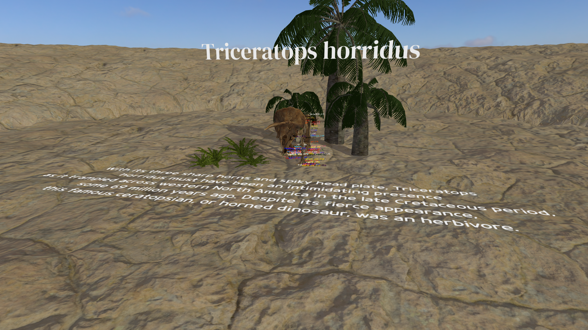

# three-openll-labels
 
Three.js + Vite + TypeScript Project to showcase OpenLL-based Font Rendering

- [Demo]()
- [Jump to CLI commands](#cli-commands)

---


## Stuff included in the `scene.ts`
- [x] Triceratops
- [x] Triceratops Animations
- [x] Labels
- [x] Animated Labels

## Tech Stack

- Three.js
- TypeScript
- Vite
- OpenLL

## CLI Commands

Installation

```bash
npm i
```

Run dev mode

```bash
npm run dev
```

Build

```bash
npm run build
```

Run build

```bash
npm run preview
```
